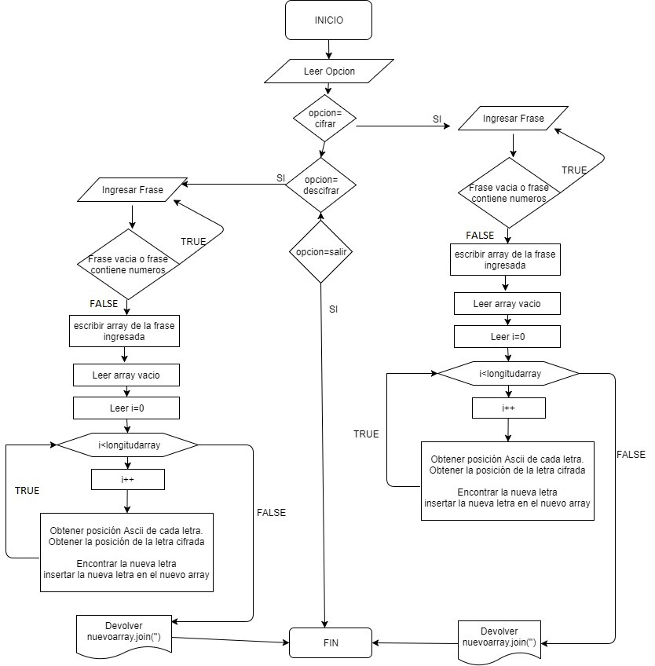
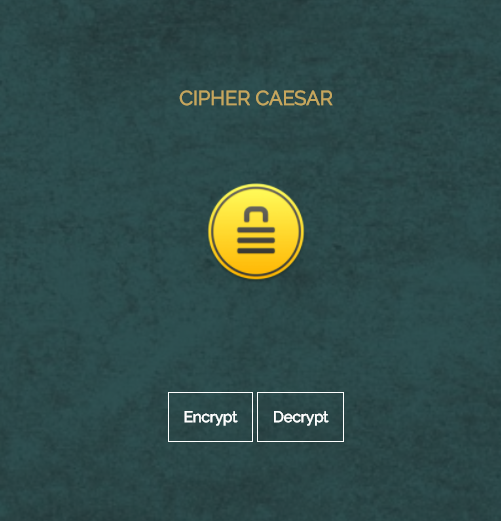
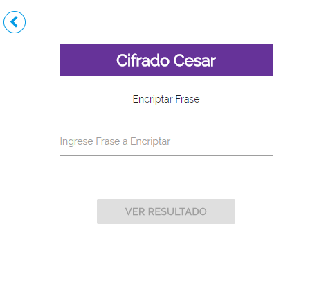
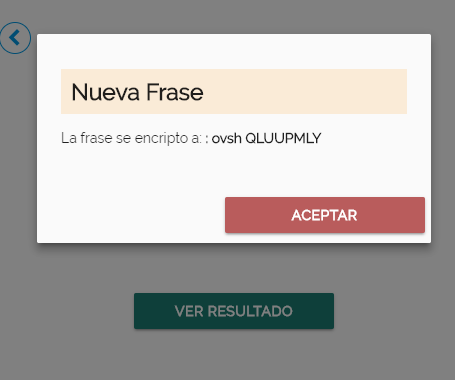
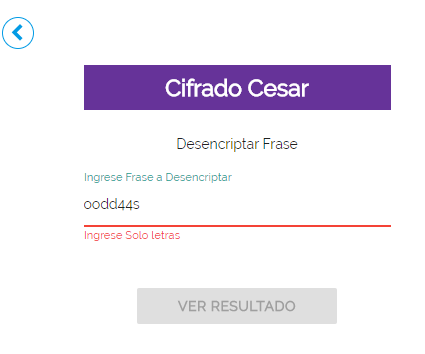
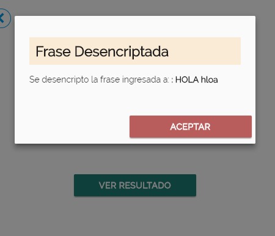

# CIFRADO CÉSAR (ECMAScript 6)
***
## Objetivos
- Se nos pide crear una  web que pida una frase al usuario y devuelva el mismo mensaje encriptado según el algoritmo de Cifrado César con el parámetro de desplazamiento de 33 espacios hacia la derecha
- El programa es capaz de cifrar y descifrar tanto letras mayúsculas como minúsculas. 
## Diagrama de flujo de la aplicación

## Funcionalidad 
- vista inicio para acceder a encriptar o desencriptar frase según lo requiera el usuario

- Vista Encriptar , se considero  mostrar los resultados de la frase en una ventana modal.

- Vista Desencriptar  se considero mostrar mensaje de alerta , en caso el campo sea vacio o contenga números

## webSite
* Puede ver el [Proyecto en vivo](https://jennifercarmen.github.io/cifradoCesar_es6/)

## Desarrollado con:

`Lenguaje estandar ECMAScript` `Javascript`  `Jquery` `CSS3` `Materialize` 

***

## Creditos
* Carmen Sosa Jennifer
